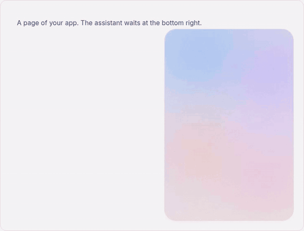
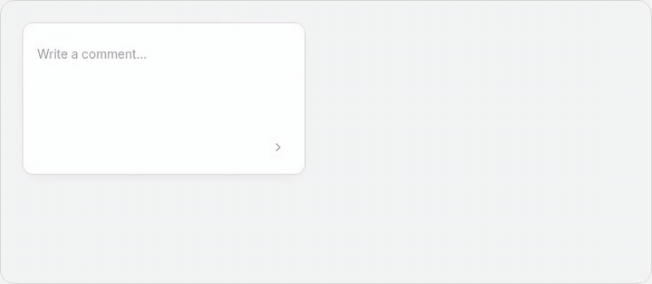
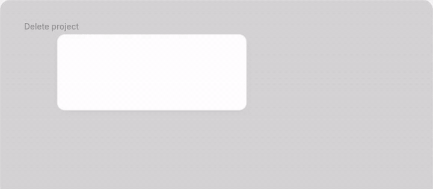
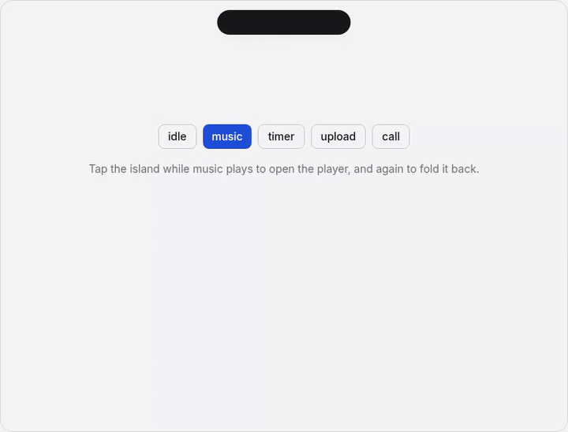
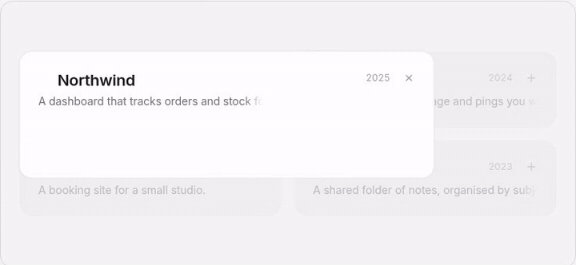
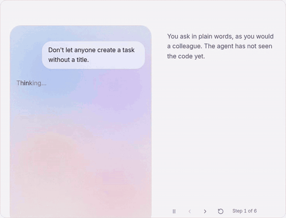
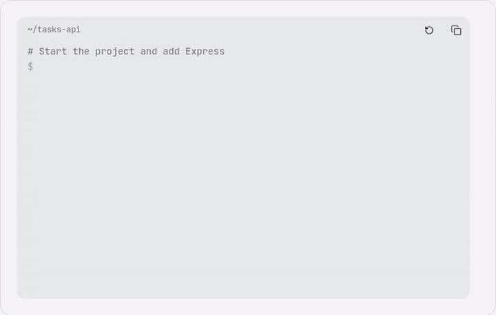
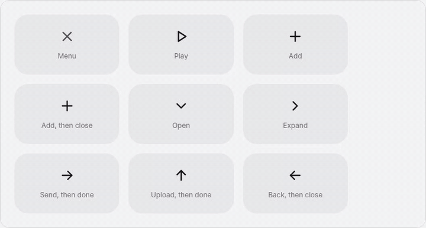
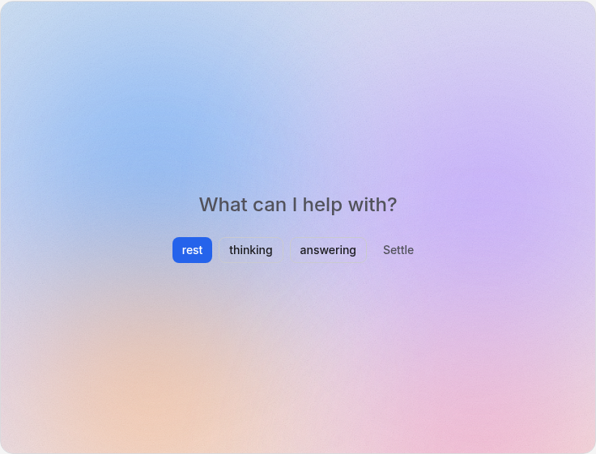

<p align="center">
  <picture>
    <source media="(prefers-color-scheme: dark)" srcset="assets/logo-dark.png" />
    
  </picture>
</p>

# elastic-ui

A Vue 3 component library where things transform instead of appearing, and the site that shows it. The repository is a workspace with two packages:

- `packages/elastic-ui` — the library, published on npm as [`@joseestevez/vue-elastic-ui`](https://www.npmjs.com/package/@joseestevez/vue-elastic-ui).
- `site` — the library's site: a landing and the docs, built with the library itself.

<p align="center">
  
</p>

<p align="center"><sub>ChatMorph over Aurora: the button is the panel, and your question is the first message.</sub></p>

## See it move

Most parts change shape instead of swapping in. A few of them, recorded from the site:

<table>
  <tr>
    <td width="50%"></td>
    <td width="50%"></td>
  </tr>
  <tr>
    <td align="center"><sub><code>ComposeMorph</code>: a button that becomes a form, then a thank-you.</sub></td>
    <td align="center"><sub><code>DialogMorph</code>: the button's box becomes the dialog and folds back on close.</sub></td>
  </tr>
  <tr>
    <td width="50%"></td>
    <td width="50%"></td>
  </tr>
  <tr>
    <td align="center"><sub><code>DynamicIsland</code>: a pill that takes the shape of what it shows.</sub></td>
    <td align="center"><sub><code>ExpandableCard</code>: a card in a grid that opens in place.</sub></td>
  </tr>
  <tr>
    <td width="50%"></td>
    <td width="50%"></td>
  </tr>
  <tr>
    <td align="center"><sub><code>AgentReplay</code>: an agent session you can play or step through.</sub></td>
    <td align="center"><sub><code>TerminalReplay</code>: commands typed and answered, ready to replay.</sub></td>
  </tr>
  <tr>
    <td width="50%"></td>
    <td width="50%"></td>
  </tr>
  <tr>
    <td align="center"><sub><code>IconMorph</code>: an icon that turns into its pair.</sub></td>
    <td align="center"><sub><code>Aurora</code>: a slow glow behind an empty chat.</sub></td>
  </tr>
</table>

The library has around sixty public parts, each with its stories. Run `npm run site` to try them live.

## Getting started

```bash
npm install
npm run storybook   # http://localhost:6006
```

The root commands delegate to the packages:

```bash
npm run build           # build the library
npm run build-storybook # static Storybook
npm run typecheck       # library and site
npm run site            # the site at http://localhost:5173
npm run site:build      # static site
```

## Docs

- [Using elastic-ui](packages/elastic-ui/USAGE.md) — the rules for building with it, for people and coding agents alike.
- [Design decisions](packages/elastic-ui/DECISIONS.md) — how it is made and why.
- [Roadmap](ROADMAP.md) — where it is and what comes next.
- [AGENTS.md](AGENTS.md) — working conventions for this repo.

## License

MIT.
